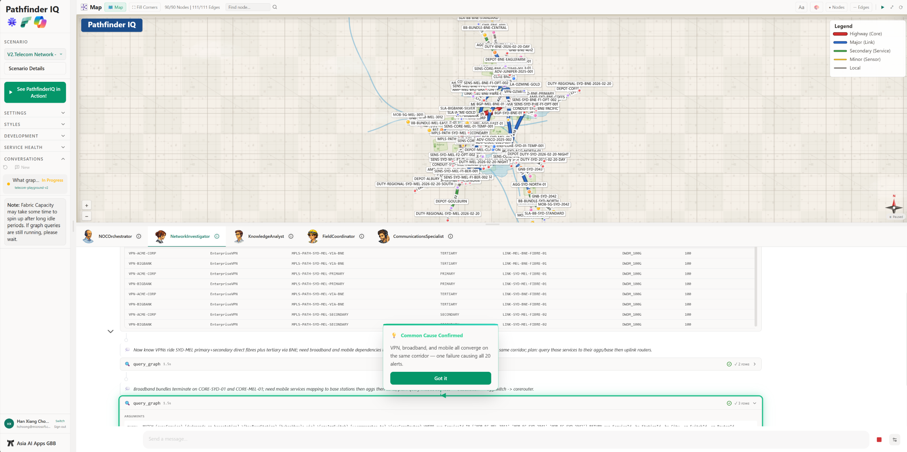

# PathfinderIQ — Azure AI Multi-Agent Graph Explorer

A multi-agent system for investigating network incidents using **Azure Cosmos DB**
for graph topology (Gremlin API) and telemetry (NoSQL API), plus **Azure AI Search**
document retrieval. Built on the **Azure AI Agent Framework SDK** consuming the
reusable **agentkit** kernel (datasource adapters + tool envelope), with a React
frontend and declarative scenario configuration.

**NOTE:** This is the demo version, with all sorts of cool features for presentation - For the streamlined, production-ready version, please contact the authors.

> **2026-06-19 — Cosmos migration.** The data backend was migrated off Microsoft
> Fabric to **Azure Cosmos DB** (Gremlin for graph, NoSQL for telemetry) via the
> agentkit datasource adapters. See [AUTODEV.md](AUTODEV.md) and
> [build_spec/CURRENT_STATE.md](build_spec/CURRENT_STATE.md).



## Key Capabilities

- **Multi-agent orchestration** — An orchestrator agent decomposes incidents and delegates to specialist agents (network investigator, knowledge analyst, field coordinator, communications specialist)
- **Graph-powered reasoning** — Queries network topology in Azure Cosmos DB (Gremlin API) using Apache TinkerPop traversals
- **Telemetry correlation** — Queries alerts, link metrics, and sensor readings from Azure Cosmos DB (NoSQL API) using Cosmos SQL
- **Knowledge retrieval** — Searches runbooks, historical tickets, equipment specs, and infrastructure docs via Azure AI Search
- **Real-time streaming** — SSE-based streaming with live visibility into sub-agent reasoning
- **Declarative scenarios** — Agents, tools, prompts, and data bindings defined in YAML — no code changes required
- **Session persistence** — Conversation state stored in Cosmos DB with per-user isolation
- **Built-in observability** — OpenTelemetry tracing, structured logging, and a live log stream panel

---

## Table of Contents

1. [Architecture Overview](#architecture-overview)
2. [Prerequisites](#prerequisites)
3. [Quick Start — Local Development](#quick-start--local-development)
4. [Configuration Reference](#configuration-reference)
5. [Scenario System](#scenario-system)
6. [Azure Deployment](#azure-deployment)
7. [Cross-Tenant Fabric Setup](#cross-tenant-fabric-setup)
8. [RBAC Requirements](#rbac-requirements)
9. [Project Structure](#project-structure)
10. [Contributing](#contributing)
11. [License](#license)

---

## Architecture Overview

### Container Architecture

```
supervisord (PID 1)
├── nginx         (port 80 — static frontend + /api/ reverse proxy)
└── uvicorn       (port 8000 — FastAPI backend, 1 worker)
```

Container Apps ingress → port 80 → nginx routes:
- `/` → Vite-built React SPA (`/workspace/static/`)
- `/api/*` → Reverse proxy to uvicorn (`127.0.0.1:8000`)

### Agent System

The orchestrator agent decomposes incidents into investigation steps and delegates to specialist agents:

| Agent | Role | Tools |
|-------|------|-------|
| **NOCOrchestrator** | Decomposes, delegates, synthesizes | delegation, network actions, dispatch |
| **NetworkInvestigator** | Graph + telemetry analysis | query_graph (Gremlin), query_alerts/telemetry (Cosmos SQL) |
| **KnowledgeAnalyst** | Document retrieval | search_runbooks, search_tickets |
| **FieldCoordinator** | Field ops + logistics | query_graph, search_equipment/infra_specs |
| **CommunicationsSpecialist** | Customer comms | create_ticket, update_advisory, send_email |

Agents are defined declaratively in `scenario.yaml` — no code changes to add/modify agents.

### Data Sources

| Source | Technology | Purpose |
|--------|-----------|---------|
| Graph topology | Azure Cosmos DB (Gremlin API) | Network structure: nodes, links, sensors, services — queried with Gremlin traversals |
| Telemetry | Azure Cosmos DB (NoSQL API) | Alerts, link metrics, sensor readings — queried with Cosmos SQL |
| Documents | Azure AI Search | Runbooks, tickets, equipment specs, infra specs |
| Sessions | Cosmos DB NoSQL | Conversation persistence (RBAC-only, no keys) |

### Backend Layer Hierarchy

```
Level 0: Foundation     — config, models, errors, resilience, credentials
Level 1: Scenario       — YAML loading, agent config parsing
Level 2: Services       — LLM provider, session store, conversation lifecycle
Level 3: Tools          — graph explorer, telemetry, search, delegation, actions
Level 4: Routers        — HTTP endpoints, SSE streaming, auth middleware
Level 5: App Shell      — main.py composition, middleware, lifespan
```

### Credential Resolution

The backend resolves Azure credentials via a 3-tier priority chain:

1. **Cross-tenant SP** — if `FABRIC_TENANT_ID` + `FABRIC_CLIENT_ID` + `FABRIC_CLIENT_SECRET` are all set → `ClientSecretCredential`
2. **Managed identity** — if running in Azure (Container Apps, AKS) → `DefaultAzureCredential`
3. **Local dev** — `AzureCliCredential` (uses `az login` session)

---

## Prerequisites

- **Python 3.12+**
- **Node.js 20+** and npm
- **Azure CLI** (`az login`)
- **Azure subscription** with the following services provisioned:
  - Azure AI Foundry (with project and model deployments)
  - Azure AI Search
  - Azure Container Registry
  - Azure Container Apps Environment
  - Azure Cosmos DB (optional, for session persistence)
- **Microsoft Fabric workspace** with:
  - Graph Model (ontology with vertex/edge data)
  - Eventhouse with KQL database (telemetry data)

---

## Quick Start — Local Development

### 1. Clone the Repository

```bash
git clone https://github.com/han-microsoft/PathfinderIQ-Demo-Version.git
cd pathfinderiq_azure_native_agentic_graphs
```

### 2. Install Backend Dependencies

```bash
cd app/backend
python3 -m venv .venv
source .venv/bin/activate
pip install -e .
```

### 3. Install Frontend Dependencies

```bash
cd app/frontend
npm install
```

### 4. Configure Environment

Copy the example config and fill in your values:

```bash
cp control/.env.example control/.env
```

Edit `control/.env` with your Azure resource details:

```bash
# ── REQUIRED ─────────────────────────────────────────────────────
# Azure AI Agent Framework — get from AI Foundry → Project → Overview
AZURE_AI_PROJECT_ENDPOINT=https://<your-ai-foundry>.services.ai.azure.com/api/projects/<your-project>
AZURE_OPENAI_RESPONSES_DEPLOYMENT_NAME=gpt-4o   # or your model deployment name

# Scenario to load (the included demo scenario)
SCENARIO_NAME=telecom-playground-v2
LLM_PROVIDER=agent

# Azure AI Search — enables document retrieval tools
AI_SEARCH_ENDPOINT=https://<your-search-service>.search.windows.net

# ── OPTIONAL: Fabric credentials (cross-tenant) ─────────────────
# Required only if your Fabric workspace is in a different Entra tenant.
# Leave empty for same-tenant (uses your az login session).
FABRIC_TENANT_ID=
FABRIC_CLIENT_ID=
FABRIC_CLIENT_SECRET=

# ── OPTIONAL: Auth ───────────────────────────────────────────────
# Set false for local dev without Entra login
AUTH_ENABLED=false

# ── OPTIONAL: Session Persistence ────────────────────────────────
# Empty = in-memory (data lost on restart, fine for dev)
# COSMOS_SESSION_ENDPOINT=https://<your-cosmos>.documents.azure.com:443/
```

### 5. Update Scenario Resource IDs

Edit the scenario file to point to your Fabric resources:

```yaml
# File: graph_data/data/scenarios/telecom-playground-v2/scenario.yaml
# Update the services.fabric section:

services:
  fabric:
    workspace_id: "<your-fabric-workspace-id>"
    graph_model_id: "<your-graph-model-id>"
    eventhouse_query_uri: "https://<your-cluster>.kusto.fabric.microsoft.com"
    kql_db_name: "EH_TelecomV2"
```

### 6. Start the Backend

```bash
cd app/backend
source .venv/bin/activate
uvicorn app.main:app --host 0.0.0.0 --port 8000 --reload
```

### 7. Start the Frontend

```bash
cd app/frontend
npm run dev
```

Open `http://localhost:5173` — API calls are proxied to the backend at `localhost:8000`.

### 8. Run Tests

```bash
cd app/backend
python3 -m pytest tests/unit/ -v
```

---

## Configuration Reference

### Three Configuration Layers

| Layer | File | Purpose | Who sets it |
|-------|------|---------|------------|
| Infrastructure | `graph_data/azure_config.env` | Provisioned resource names, ACR, managed identity | `deploy_infra.sh` (auto-generated) |
| Runtime secrets | `control/.env` | AI Foundry endpoint, Fabric SP creds, auth, search | Developer / deploy script |
| Scenario bindings | `scenario.yaml` | Fabric resource IDs, search index names, agents | Scenario author |

### control/.env Variables

| Variable | Required | Purpose |
|----------|----------|---------|
| `AZURE_AI_PROJECT_ENDPOINT` | Yes | AI Foundry project endpoint |
| `AZURE_OPENAI_RESPONSES_DEPLOYMENT_NAME` | Yes | Model deployment name |
| `SCENARIO_NAME` | Yes | Scenario folder name under `graph_data/data/scenarios/` |
| `LLM_PROVIDER` | Yes | `agent` (AI Agent Framework) or `openai` (direct) |
| `AI_SEARCH_ENDPOINT` | Yes | Azure AI Search endpoint URL |
| `FABRIC_TENANT_ID` | If cross-tenant | Data owner's Entra tenant ID |
| `FABRIC_CLIENT_ID` | If cross-tenant | Multi-tenant app registration client ID |
| `FABRIC_CLIENT_SECRET` | If cross-tenant | App registration client secret |
| `AUTH_ENABLED` | No (default: true) | `false` for local dev without Entra login |
| `AUTH_CLIENT_ID` | If AUTH_ENABLED=true | Entra app registration for frontend auth |
| `COSMOS_SESSION_ENDPOINT` | No | Cosmos DB endpoint for persistent sessions |

### scenario.yaml Key Sections

```yaml
services:
  fabric:
    workspace_id: "<GUID>"                                        # Fabric workspace
    graph_model_id: "<GUID>"                                      # Graph Model item ID
    eventhouse_query_uri: "https://<cluster>.kusto.fabric.microsoft.com"
    kql_db_name: "EH_TelecomV2"                                   # KQL database name

data_sources:
  search_indexes:
    runbooks:
      index_name: "telecom-v2-runbooks-index"
    tickets:
      index_name: "telecom-v2-tickets-index"
    equipment:
      index_name: "telecom-v2-equipment-index"
    infra_specs:
      index_name: "telecom-v2-infra-specs-index"
```

---

## Scenario System

A scenario is a self-contained configuration package defining agents, tools, prompts, data sources, and UI assets. Everything — from agent identities to data bindings — lives in configuration, not code.

### Scenario Directory Structure

```
graph_data/data/scenarios/<scenario-name>/
├── scenario.yaml              # Master manifest (agents, tools, data bindings)
├── graph_schema.yaml          # Ontology vertex/edge definitions
├── deploy_manifest.yaml       # Fabric deployment targets
├── search_manifest.yaml       # AI Search index definitions
├── data/
│   ├── entities/              # Graph CSV data (vertices + edges)
│   ├── telemetry/             # Telemetry CSV data (alerts, metrics, sensors)
│   ├── knowledge/             # Documents for AI Search
│   │   ├── runbooks/          # SOPs, diagnostic procedures
│   │   ├── tickets/           # Historical incident tickets
│   │   ├── equipment/         # Equipment specifications
│   │   └── infra_specs/       # Infrastructure documentation
│   └── prompts/               # Agent instruction markdown files
├── ui/                        # Agent headshots, logos, replay config
└── saved_conversations/       # Pre-saved demo sessions (JSON)
```

### Included Scenario: `telecom-playground-v2`

A fibre cut on the Sydney–Melbourne corridor triggers a cascading alert storm affecting enterprise VPNs, broadband, and mobile services. The AI investigates root cause, blast radius, and remediation — coordinating network investigation, knowledge search, and field dispatch across specialist agents.

### Adding a New Scenario

A scenario is a self-contained **pack** that swaps over a constant backend core.
The agents, prompts, tools, datasource bindings, and UI assets all live in the
pack — no code changes.

1. Create a directory under `graph_data/data/scenarios/<your-scenario>/`.
2. Write `scenario.yaml` — agents, per-agent `tools` (as `module:function` specs),
   `instructions` (markdown files), `data_sources` (graph/telemetry/search
   bindings), and `ui`. Use `telecom-playground-v2` as the template.
3. Add the agent prompt markdown files referenced by each agent's `instructions`.
4. Populate graph entity CSVs, telemetry CSVs, and knowledge documents.
5. **Validate the pack contract** before provisioning:
   ```bash
   python3 graph_data/scripts/validate_scenario.py --scenario <your-scenario>
   ```
6. **Provision every data surface with one command** (graph + telemetry → Cosmos,
   knowledge → Azure AI Search, topology → frontend):
   ```bash
   python3 graph_data/scripts/provision_scenario.py --scenario <your-scenario> \
     --gremlin-endpoint wss://... --nosql-endpoint https://... --upload-files
   ```
   Per the pack's `data_sources.graph`/`telemetry` block, the scenario seeds into
   its **own Cosmos database** (default falls back to the operator default for
   backward compatibility).
7. The pack is picked up automatically — it appears in the in-app **Use case**
   switcher (no env change, no redeploy needed once the image contains the pack).

### Runtime Scenario Swap

PathfinderIQ swaps an **entire use-case** — agents, prompts, tools, datasource
bindings, and graph topology — at runtime while the backend core stays constant.

**How it works (3-tier resolution):**

1. The frontend **Use case** selector (sidebar) sends an `X-Scenario-Name` header
   on every API call.
2. On a page load with no header, the backend restores the user's last choice
   from their per-user preference (`GET /api/preferences`).
3. Otherwise the operator default `SCENARIO_NAME` applies.

Each request resolves its scenario into a frozen `RequestScope`, so agents,
prompts, tools, search indexes, and Cosmos db/graph/container bindings all rebind
to the selected pack per request — with no global state and full per-user
isolation. Switching is a single header; the selector persists the choice and is
validated against the on-disk pack catalogue.

**Endpoints:**

| Endpoint | Purpose |
|----------|---------|
| `GET /api/scenarios` | List available packs + the active one |
| `POST /api/scenarios/select` | Persist the current user's scenario choice |
| `GET /api/preferences` | The current user's scenario-only preferences |

**Verify a live swap** (signed dev-sign probe — works against `AUTH_ENABLED=true`):

```bash
PYTHONPATH=app/backend python3 scripts/scenario_swap_probe.py --base-url https://<fqdn>
# → SWAP_PROBE_OK
```

---

## Azure Deployment

Deployment is a four-stage pipeline. Each stage has its own script and can be run independently.

### Stage 1: Provision Core Azure Infrastructure

```bash
cd graph_data
./deploy_infra.sh
```

Provisions: Resource Group, AI Foundry + Project, AI Search, Storage Account, Key Vault. Writes provisioned resource names to `azure_config.env`.

**Azure Region:** Default is `swedencentral`. Override with:

```bash
./deploy_infra.sh --location australiaeast   # CLI flag (highest priority)
# Or set AZURE_LOCATION=australiaeast in graph_data/azure_config.env
```

Other options:
```bash
./deploy_infra.sh --skip-infra    # Skip base infra, run only --app-infra
./deploy_infra.sh --yes           # Skip confirmation prompts
```

### Stage 2: Provision Container App Infrastructure

```bash
cd graph_data
./deploy_infra.sh --app-infra
```

Deploys via Bicep: Container Apps Environment, Container Registry (ACR), Container App, Managed Identity, Cosmos DB session store. Depends on Stage 1 outputs.

### Stage 3: Deploy Scenario Data

Install the graph_data package dependencies:

```bash
cd graph_data && uv sync && cd ..
```

Set Fabric credentials (or source from `control/.env`):

```bash
export FABRIC_TENANT_ID=<your-fabric-tenant-id>
export FABRIC_CLIENT_ID=<your-client-id>
export FABRIC_CLIENT_SECRET=<your-client-secret>
```

Deploy each data layer:

```bash
# Graph topology (CSV → Fabric Lakehouse → Ontology)
python3 graph_data/scripts/deploy_graph.py \
  --manifest graph_data/data/scenarios/telecom-playground-v2/deploy_manifest.yaml

# Telemetry data (CSV → Fabric Eventhouse KQL tables)
python3 graph_data/scripts/deploy_telemetry.py \
  --manifest graph_data/data/scenarios/telecom-playground-v2/deploy_manifest.yaml

# Knowledge documents (Markdown/text → Azure AI Search indexes)
python3 graph_data/scripts/deploy_search.py \
  --manifest graph_data/data/scenarios/telecom-playground-v2/search_manifest.yaml \
  --upload-files

# Frontend graph visualization layout
python3 graph_data/scripts/generate_topology.py \
  --scenario-dir graph_data/data/scenarios/telecom-playground-v2
```

All scripts accept `--manifest` for declarative config or explicit `--workspace-id`, `--tenant-id` flags. See each script's `--help`.

### Stage 4: Build & Deploy Application

```bash
./deploy_app.sh
```

This script:
1. Loads `graph_data/azure_config.env` + `control/.env`
2. Builds Docker image on ACR (remote build — no local Docker required)
3. Updates Container App with new image + environment variables
4. Activates latest revision and verifies health
5. Rolls back to previous revision if health check fails

Options:
```bash
./deploy_app.sh --build-only     # Build and push image only
./deploy_app.sh --update-only    # Update env vars with existing image
./deploy_app.sh --tag v1.2.3     # Custom image tag
./deploy_app.sh --yes            # Skip confirmation prompts
```

### End-to-End First Deployment

```bash
# 1. Provision base Azure infra
cd graph_data && ./deploy_infra.sh

# 2. Provision container hosting
./deploy_infra.sh --app-infra

# 3. Configure runtime secrets
cd .. && cp control/.env.example control/.env
# Edit control/.env with your AI Foundry endpoint, Fabric SP creds, etc.

# 4. Update scenario resource IDs
# Edit graph_data/data/scenarios/telecom-playground-v2/scenario.yaml
# Edit graph_data/data/scenarios/telecom-playground-v2/deploy_manifest.yaml

# 5. Deploy scenario data
python3 graph_data/scripts/deploy_graph.py \
  --manifest graph_data/data/scenarios/telecom-playground-v2/deploy_manifest.yaml
python3 graph_data/scripts/deploy_telemetry.py \
  --manifest graph_data/data/scenarios/telecom-playground-v2/deploy_manifest.yaml
python3 graph_data/scripts/deploy_search.py \
  --manifest graph_data/data/scenarios/telecom-playground-v2/search_manifest.yaml \
  --upload-files

# 6. Build and deploy the application
./deploy_app.sh --yes
```

### Model Deployments

Deploy these models in AI Foundry before running:

| Model | Purpose |
|-------|---------|
| Chat model (e.g., `gpt-4o`) | Agent reasoning — referenced in scenario.yaml per agent |
| `text-embedding-3-small` | Used by AI Search for document vectorization |

### WSL Note

If running on WSL with the **Windows** `az` CLI (via interop), file paths are automatically converted from `/mnt/c/...` to `C:/...` by both deploy scripts.

---

## Cross-Tenant Fabric Setup

Required only when the Fabric workspace is in a different Entra ID tenant than your application.

```
Tenant A (App Host)                    Tenant B (Data Owner)
┌──────────────────────┐              ┌──────────────────────┐
│ App Registration     │              │ Service Principal    │
│ (multi-tenant)       │──(consent)──→│ (provisioned via     │
│ Client ID:           │              │  admin consent)      │
│ <your-client-id>     │              │                      │
│                      │              │ Fabric Workspace     │
│ Container App        │              │ <your-workspace-id>  │
│ (or local dev)       │──(token)────→│ Members: SP + users  │
└──────────────────────┘              └──────────────────────┘
```

### Step 1: Create Multi-Tenant App Registration (Tenant A)

```bash
# In Entra admin center → App registrations → New registration
# Audience: "Accounts in any organizational directory" (AzureADMultipleOrgs)

# Add redirect URI for the admin consent flow
az ad app update --id <CLIENT_ID> --web-redirect-uris "http://localhost"

# Create a client secret (note the value — shown only once)
az ad app credential reset --id <CLIENT_ID> --append
```

### Step 2: Grant Admin Consent (Tenant B)

Share this URL with a Global Admin / Application Admin in Tenant B:

```
https://login.microsoftonline.com/<TENANT_B_ID>/adminconsent?client_id=<CLIENT_ID>&redirect_uri=http://localhost
```

> **Note:** The consenting user must have an Entra ID directory role (Global Admin, Application Admin, or Cloud Application Admin). Fabric Admin alone is not sufficient.

**Common errors:**
- `AADSTS500113` → Missing redirect URI. Run step 1's `az ad app update` command.
- `AADSTS900561` → Wrong redirect URI format. Use `http://localhost`, not `oauth2/nativeclient`.

### Step 3: Enable SP API Access in Fabric (Tenant B)

In the Fabric Admin Portal → Tenant settings → Developer settings:
1. Enable **"Service principals can call Fabric public APIs"**
2. Set scope to specific security groups
3. Add the Service Principal to the allowed security group

### Step 4: Grant Workspace Access (Tenant B)

- Fabric portal → target workspace → Manage access
- Add the Service Principal as **Member** or **Contributor**

### Step 5: Configure Environment Variables

```bash
# In control/.env
FABRIC_TENANT_ID=<TENANT_B_ID>
FABRIC_CLIENT_ID=<CLIENT_ID>
FABRIC_CLIENT_SECRET=<SECRET>
```

### Step 6: Verify Access

```bash
TOKEN=$(az account get-access-token \
  --tenant <TENANT_B_ID> \
  --resource https://api.fabric.microsoft.com \
  --query accessToken -o tsv)

curl -s -H "Authorization: Bearer $TOKEN" \
  "https://api.fabric.microsoft.com/v1/workspaces/<WORKSPACE_ID>/items" \
  | python3 -m json.tool
```

---

## RBAC Requirements

### Managed Identity Roles (same-tenant)

| Resource | Role | Purpose |
|----------|------|---------|
| AI Foundry | Azure AI Developer | Agent framework API |
| AI Foundry | Cognitive Services OpenAI User | Model inference |
| AI Search | Search Index Data Contributor | Query indexes |
| AI Search | Search Service Contributor | Index management |
| Cosmos DB | Cosmos DB Built-in Data Contributor | Session CRUD (data plane) |
| Storage | Storage Blob Data Reader | Read saved conversations |
| Key Vault | Key Vault Secrets User | Read secrets |

```bash
PRINCIPAL_ID=$(az identity show -n <identity-name> -g <resource-group> --query principalId -o tsv)

# AI Foundry — resource group scope
az role assignment create --assignee $PRINCIPAL_ID \
  --role "Azure AI Developer" \
  --scope /subscriptions/<sub>/resourceGroups/<rg>

# AI Search — service scope
az role assignment create --assignee $PRINCIPAL_ID \
  --role "Search Index Data Contributor" \
  --scope /subscriptions/<sub>/resourceGroups/<rg>/providers/Microsoft.Search/searchServices/<search-name>

# Cosmos DB — data plane (not ARM RBAC)
az cosmosdb sql role assignment create \
  --account-name <cosmos-name> --resource-group <rg> \
  --role-definition-id 00000000-0000-0000-0000-000000000002 \
  --principal-id $PRINCIPAL_ID \
  --scope /subscriptions/<sub>/resourceGroups/<rg>/providers/Microsoft.DocumentDB/databaseAccounts/<cosmos-name>
```

### Service Principal Roles (cross-tenant Fabric)

| Access | How to Grant |
|--------|-------------|
| Fabric workspace Member | Add SP in workspace → Manage access |
| Fabric API access | Add SP to security group in Tenant B's Fabric admin settings |
| KQL database Viewer | Inherited from workspace membership |

---

## Project Structure

```
pathfinderiq_azure_native_agentic_graphs/
├── app/
│   ├── backend/
│   │   ├── app/
│   │   │   ├── foundation/        # L0: Config, models, errors, resilience, credentials
│   │   │   ├── scenario/          # L1: Scenario YAML loading, registry
│   │   │   ├── services/          # L2: LLM providers, session store, conversation lifecycle
│   │   │   │   ├── llm/           #     Agent Framework + OpenAI providers
│   │   │   │   ├── session_store/ #     InMemory + Cosmos DB stores
│   │   │   │   └── conversation/  #     Turn lifecycle, context window, metadata
│   │   │   ├── routers/           # L4: HTTP endpoints, SSE streaming
│   │   │   ├── guardrails/        #     Input/output content safety
│   │   │   ├── llmops/            #     LLM operations tracing
│   │   │   ├── observability/     #     OpenTelemetry bootstrap, metrics
│   │   │   └── main.py            # L5: App composition, lifespan
│   │   ├── agents/                # L3: Agent registry, builder, prompts, tools
│   │   ├── tools/                 # L3: Tool implementations
│   │   │   ├── graph_explorer/    #     Cosmos DB Gremlin graph queries
│   │   │   ├── telemetry/         #     Cosmos DB NoSQL telemetry queries
│   │   │   ├── search/            #     Azure AI Search tools
│   │   │   ├── delegation/        #     Inter-agent delegation
│   │   │   ├── dispatch/          #     Field engineer dispatch
│   │   │   ├── network/           #     Network actions (reroute, link status)
│   │   │   ├── incidents/         #     Ticket creation, advisory updates
│   │   │   └── workiq/            #     M365 data query
│   │   └── tests/                 #     Unit, integration, contract tests
│   ├── frontend/
│   │   └── src/
│   │       ├── api/               # HTTP client, SSE streaming, types
│   │       ├── stores/            # Zustand: chat, sessions, agents, settings
│   │       ├── components/        # Chat, graph viz, sidebar, layout, observability
│   │       ├── features/          # Chat message building, replay engine
│   │       ├── hooks/             # Auto-scroll, resize, scenario, session events
│   │       └── auth/              # MSAL-based Entra ID authentication
│   └── dev.sh                     # Local dev launcher (backend + frontend)
├── control/
│   ├── .env.example               # Environment config template
│   └── .env                       # Runtime secrets (git-ignored)
├── deploy/
│   ├── nginx.conf                 # Reverse proxy + SPA routing
│   └── supervisord.conf           # Process manager (nginx + uvicorn)
├── graph_data/
│   ├── infra/                     # Bicep IaC modules
│   ├── scripts/                   # Data deployment scripts (graph, telemetry, search)
│   ├── data/scenarios/            # Scenario manifests and data assets
│   ├── deploy_infra.sh            # Azure infrastructure provisioning
│   └── azure_config.env.template  # Infrastructure config template
├── .github/
│   ├── ip-metadata.json           # GBB Central Catalog metadata
│   └── thumbnail.png              # Catalog preview image
├── Dockerfile.unified             # Single-container: nginx + uvicorn
└── deploy_app.sh                  # Build + deploy to Container Apps
```

---

## Contributing

Contributions are welcome. Please open an issue or pull request.

## License

MIT
